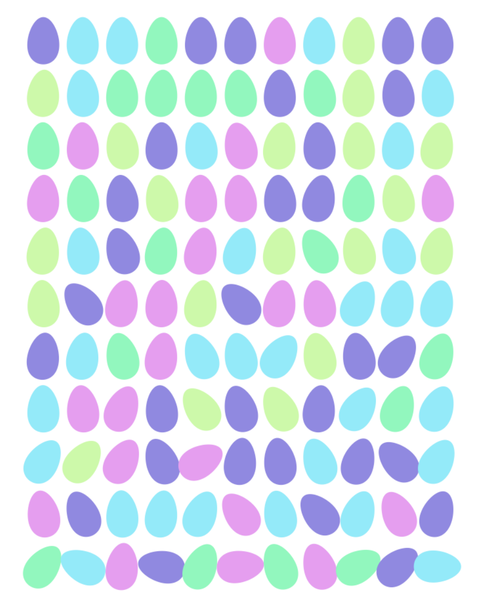

# Goals of document

1. <span class='stripy-text'>Have fun</span>
2. Try and make a pretty egg picture
3. Accidentally practice and learn some coding things

A glimpse of where we're going:

<center></center>

# Getting started

## Packages

```{r message=FALSE}
# For some nice easy plotting
library(ggplot2)

# For some "perlin noise" to rotate our eggs.... huh?
library(ambient)
```

## Plotting with ggplot2 basics

```{r}
head(diamonds, 3)
```

`ggplot()` makes your canvas and `geom_<shape>()` puts your art on the canvas.
The `aes()` (aesthetic) is where you tell `ggplot()` your `x` and `y`.

```{r}
ggplot(diamonds, aes(x = carat, y = price)) +
  geom_point()
```

You can customize the plots p easily after they're made by `+`-ing things on.  Us as beautimus artists might not want our canvas to have all the data looking things.  We can use `theme_void()` to clean everything out.

```{r}
ggplot(diamonds, aes(x = carat, y = price)) +
  geom_point() +
  theme_void()
```

Last 2 `ggplot2` tactics to know about know.  

1. If using multiple data sources we can specify `aes()` in the `geom_<shape>()`.
2. We can color!

```{r}
# my diamond is big but cheap
my_diamond <- data.frame(carat = 5, price = 5000)

ggplot() +
  geom_point(data = diamonds, aes(x = carat, y = price)) +
  geom_point(data = my_diamond, aes(x = carat, y = price), color = "#ff8200") +
  theme_void()
```

Okay, using all of this let's make some eggs!

# It's egg time

## Eggs from math o_O?

Hardcore research*: 

1. Googled "math formula to draw an egg"
  * [See here](https://letmegooglethat.com/?q=math+formula+to+draw+an+egg)
2. Saw some math:
  * [See here](https://www.mathematische-basteleien.de/eggcurves.htm#:~:text=You%20can%20develop%20the%20shape,*t(x)%3D1.)

<sub>*i'm oldschool so i used google instead of chatgpt... for this...</sub>

Result of research:

> You can develop the shape of a hen egg, if you change the equation of a oval a little. You multiply y or y² by a suitable term t(x), so that y becomes smaller on the right side of the y-axis and larger on the left side. y(x=0) must not be changed. 
> The equation of the ellipse e.g. $\frac{x^2}{9} + \frac{y^2}{4} = 1$ change to $\frac{x^2}{9} + \frac{y^2}{4} \dot{} t(x) = 1$
>
> ...[example t(x)] $t(x) = \frac{1}{1 - 0.2x}$

Okay... we can definitely write a function for $t(x)$

```{r}
# shoutout baker skateboards: https://www.youtube.com/watch?v=cdbfSfnRDX4
t_func <- function(x) {
  1 / (1 - 0.2 * x)
}
```

How to make a function from this: $\frac{x^2}{9} + \frac{y^2}{4} \dot{} t(x) = 1$... that umm gets trickier.  Maybe we go new school on this.  I've ChatGPT'd:

> this is a formula for an egg based on an ellipse formula: $\frac{x^2}{9} + \frac{y^2}{4} \dot{} t(x) = 1$. write an R function that takes in a center point (x and y), an x radius, a y radius, and a function (named t) as parameters to draw an ellipse egg like this

How did I know what to ask? .... 

* I know a mathy word for "oval" is ellipse
* I know I want to be able to place these suckers so controlling the center point sounds nice
* I know I want to be able to control the size of em and ellipses have 2 size controls for their 2 main axes

I modified the returned code to suit our needs better.

```{r}
egg_pts <- function(cx, cy, xr = 0.9, yr = 0.6) {
  theta <- seq(0, 2 * pi, length.out = 100)

  # Calculate x and y coordinates of points on the ellipse
  x <- xr * cos(theta)
  y <- yr * sin(theta)

  # Adjust y coordinates using the t function
  y <- y * t_func(x)

  pts <- data.frame(x = x + cx, y = y + cy)

  return(pts)
}
```

## Drawing our first egg

To use the function we'll pass in a location for our egg to live.

```{r}
pts <- egg_pts(0, 0)
head(pts)
```

Did it work....?

```{r}
ggplot(pts, aes(x = x, y = y)) +
  geom_point() +
  labs(title = "it's... it's... beautiful!")
```

Holy moly we created egg.

But... we prolly don't want dot eggs... instead of `geom_point()` we can use `geom_polygon` to nicely connect them.

```{r}
ggplot(pts, aes(x = x, y = y)) +
  geom_polygon() +
  theme_void() +
  labs(title = "BOOM! egg :)")
```

## Extending the idea to more eggs

You know what's cooler than 1 egg....

<center></center>

```{r}
pts1 <- egg_pts(0, 0)
pts2 <- egg_pts(1, 2)

ggplot() +
  geom_polygon(data = pts1, aes(x = x, y = y)) +
  geom_polygon(data = pts2, aes(x = x, y = y)) +
  theme_void() +
  labs(title = "oh nooo.... we squished em")
```

We can use `coord_fixed(ratio = 1)` to tell ggplot we want an "aspect ratio" of 1 to unsquish.

```{r}
pts1 <- egg_pts(0, 0)
pts2 <- egg_pts(1, 2)

# some changes have to be made here...
ggplot() +
  geom_polygon(data = pts1, aes(x = x, y = y)) +
  geom_polygon(data = pts2, aes(x = x, y = y)) +
  theme_void() +
  coord_fixed(ratio = 1)
```

Let's get forward thinking. I want to have as many eggs as I want plotted at once. Let's rewrite our 2 egg code to be more flexible and handle any number of eggs!

```{r}
# some changes have to be made here...
eggs <- list(pts1, pts2)

canvas <- ggplot()
for (egg in eggs) {
  canvas <- canvas +
    geom_polygon(data = egg, aes(x = x, y = y))
}

canvas +
  theme_void() +
  coord_fixed(ratio = 1)
```

## Rotating our eggs!

Got dang we're cooking with gas.

Next! I don't want my eggs all laying down! We should rotate these puppies.

Rotating things can look pretty scary at first, but it's a super powerful idea and comes up in some useful stats techniques like PCA ([animation](https://adamspannbauer.github.io/pca_animation/) & [more info](https://towardsdatascience.com/a-one-stop-shop-for-principal-component-analysis-5582fb7e0a9c))!.

Rotating math is of scope for this doc, but [this is a phenomenal video for more on matrix transformations including rotation](https://www.youtube.com/watch?v=kYB8IZa5AuE).

```{r}
rotated_egg_pts <- function(cx, cy, xr = 0.9, yr = 0.6, rotate_degrees = 0) {
  theta <- seq(0, 2 * pi, length.out = 100)

  # Calculate x and y coordinates of points on the ellipse
  x <- xr * cos(theta)
  y <- yr * sin(theta)

  # Adjust y coordinates using the t function
  y <- y * t_func(x)

  # Rotate code!
  theta <- rotate_degrees * (pi / 180) # convert degress to radians

  rotation_matrix <- matrix(
    c(
      cos(theta), -sin(theta), # say where we want
      sin(theta), cos(theta) # our unit vectors to be
    ),
    ncol = 2
  )
  rotated <- cbind(x, y) %*% rotation_matrix # apply!
  x <- rotated[, 1] # pull back out x
  y <- rotated[, 2] # pull back out y
  # End of Rotate code!

  pts <- data.frame(x = x + cx, y = y + cy)

  return(pts)
}
```

So... does it... does it... work?

```{r}
pts1 <- rotated_egg_pts(0, 0, rotate_degrees = -90)
pts2 <- rotated_egg_pts(0, 1, rotate_degrees = 180)

eggs <- list(pts1, pts2)

canvas <- ggplot()
for (egg in eggs) {
  canvas <- canvas + geom_polygon(data = egg, aes(x = x, y = y))
}

canvas +
  theme_void() +
  coord_fixed(ratio = 1)
```

<center></center>

## Egg grid!!!!

We need more eggs!!

Let's create a for loop that can make a row of eggs.  The for loop just needs to update the x location of each egg.

```{r}
xs <- -5:5
n_xs <- length(xs)

eggs <- list()
for (i in 1:n_xs) {
  x <- xs[i]
  egg <- rotated_egg_pts(x, 0, rotate_degrees = -90)

  eggs[[i]] <- egg
}
```

Something happened, that's for sure. Let's plot.

```{r}
canvas <- ggplot()
for (egg in eggs) {
  canvas <- canvas +
    geom_polygon(data = egg, aes(x = x, y = y))
}

canvas +
  theme_void() +
  coord_fixed(ratio = 1)
```

MORE! Double for loop for rows and columns!

```{r}
# Multiplication is spacing things out here
xs <- -5:5 * 1.5
ys <- -5:5 * 2.2

n_xs <- length(xs)
n_ys <- length(ys)

eggs <- list()

egg_num <- 1 # keep track of how many eggs we've made
for (i in 1:n_xs) {
  for (j in 1:n_ys) {
    x <- xs[i]
    y <- ys[j]

    egg <- rotated_egg_pts(x, y, rotate_degrees = -90)

    eggs[[egg_num]] <- egg
    egg_num <- egg_num + 1
  }
}

length(eggs)
```

Show me them eggs!

```{r}
canvas <- ggplot()
for (egg in eggs) {
  canvas <- canvas +
    geom_polygon(data = egg, aes(x = x, y = y))
}

canvas +
  theme_void() +
  coord_fixed(ratio = 1)
```

## Make it more Easter with pastels

Okay... that's something!! It's missing an easter vibe though.  We need pastels.

```{r}
palette <- c("#69ffb9", "#76ecfb", "#c1fda0", "#9386e6", "#f298f4")

xs <- -5:5 * 1.5
ys <- -5:5 * 2.2

n_xs <- length(xs)
n_ys <- length(ys)

eggs <- list()

egg_num <- 1 # keep track of how many eggs we've made
for (i in 1:n_xs) {
  for (j in 1:n_ys) {
    x <- xs[i]
    y <- ys[j]

    egg <- rotated_egg_pts(x, y, rotate_degrees = -90)

    # Pick a random color and save
    color <- sample(palette, 1)
    egg$color <- color

    eggs[[egg_num]] <- egg
    egg_num <- egg_num + 1
  }
}
```

Modify our plot code to change the fill based on the new color column

```{r}
canvas <- ggplot()
for (egg in eggs) {
  canvas <- canvas + geom_polygon(data = egg, aes(x = x, y = y), fill = egg$color)
}

canvas +
  theme_void() +
  coord_fixed(ratio = 1)
```

This is the end of our plotting code changes.  It'd clean things up to hide it in a function.

```{r}
plot_eggs <- function(eggs) {
  canvas <- ggplot()
  for (egg in eggs) {
    canvas <- canvas + geom_polygon(data = egg, aes(x = x, y = y), fill = egg$color)
  }

  canvas +
    theme_void() +
    coord_fixed(ratio = 1)
}

plot_eggs(eggs)
```

:) - cute! Where do we go from here? tbh it could be over already but here are some ideas.

## Wobbly eggs :)

Personally, I think being too neat is boring... what about wobbly eggs?

```{r}
xs <- -5:5 * 1.5
ys <- -5:5 * 2.2

n_xs <- length(xs)
n_ys <- length(ys)

eggs <- list()

egg_num <- 1 # keep track of how many eggs we've made
for (i in 1:n_xs) {
  for (j in 1:n_ys) {
    x <- xs[i]
    y <- ys[j]

    # Randomize rotation
    rotate <- rnorm(1, mean = -90, sd = 10)
    egg <- rotated_egg_pts(x, y, rotate_degrees = rotate)

    # Pick a random color and save
    color <- sample(palette, 1)
    egg$color <- color

    eggs[[egg_num]] <- egg
    egg_num <- egg_num + 1
  }
}

plot_eggs(eggs)
```

What if we got wobblier or un-wobblier based on y??

```{r}
xs <- -5:5 * 1.5
ys <- 0:-10 * 2

n_xs <- length(xs)
n_ys <- length(ys)

eggs <- list()

egg_num <- 1 # keep track of how many eggs we've made
for (i in 1:n_xs) {
  for (j in 1:n_ys) {
    x <- xs[i]
    y <- ys[j]

    # Randomize rotation
    rotate_sd <- abs(y) * 2
    rotate <- rnorm(1, mean = -90, sd = rotate_sd)
    egg <- rotated_egg_pts(x, y, rotate_degrees = rotate)

    # Pick a random color and save
    color <- sample(palette, 1)
    egg$color <- color

    eggs[[egg_num]] <- egg
    egg_num <- egg_num + 1
  }
}

plot_eggs(eggs)
```

You could have this randomness be a little less random...

One way to end up with some nice organic feeling randomness is to use "noise".  In particular, "Perlin noise" is used often. This noise has been used to generate terrain in video game, simulate trees moving in the wind, or we can use it to rotate our eggs!

```{r}
xs <- -10:15 * 1.5
ys <- -10:15 * 2

n_xs <- length(xs)
n_ys <- length(ys)

# Generate the values that will rotate the eggs
noise <- noise_perlin(c(n_xs, n_ys), frequency = 0.1)

eggs <- list()

egg_num <- 1 # keep track of how many eggs we've made
for (i in 1:n_xs) {
  for (j in 1:n_ys) {
    x <- xs[i]
    y <- ys[j]

    # Randomize rotation
    # (1) pulling noise value, (2) scaling it up, &(3) centering at 90,
    rotate <- -90 + noise[i, j] * 120
    egg <- rotated_egg_pts(x, y, rotate_degrees = rotate)

    # Pick a random color and save
    color <- sample(palette, 1)
    egg$color <- color

    eggs[[egg_num]] <- egg
    egg_num <- egg_num + 1
  }
}

plot_eggs(eggs)
```

Go vols!

```{r}
palette <- c("#ff8200", "#58595b", "#58595b", "#58595b", "#58595b")

xs <- -10:15 * 1.5
ys <- -10:15 * 2

n_xs <- length(xs)
n_ys <- length(ys)

# Generate the values that will rotate the eggs
noise <- noise_perlin(c(n_xs, n_ys), frequency = 0.1)

eggs <- list()

egg_num <- 1 # keep track of how many eggs we've made
for (i in 1:n_xs) {
  for (j in 1:n_ys) {
    x <- xs[i]
    y <- ys[j]

    # Randomize rotation
    # (1) pulling noise value, (2) scaling it up, &(3) centering at 90,
    rotate <- -90 + noise[i, j] * 120
    egg <- rotated_egg_pts(xs[i], ys[j], rotate_degrees = rotate)

    # Pick a random color and save
    color <- sample(palette, 1)
    egg$color <- color

    eggs[[egg_num]] <- egg
    egg_num <- egg_num + 1
  }
}

plot_eggs(eggs)
```
